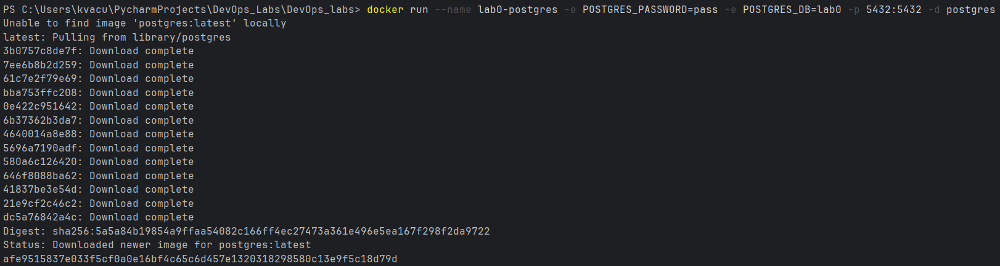

# Отчёт по Лабе 0 — свой сервис

## Описание сервиса

Приложение "Заметки" — минимальный веб-сервис для добавления и просмотра 
текстовых записей. Состоит из трёх частей:

- **Бэкенд** на Python (Flask) — обрабатывает HTTP-запросы, читает и 
  пишет данные в базу
- **Фронтенд** — HTML-страница с формой ввода и списком заметок, 
  обращается к бэкенду через fetch (JSON)
- **База данных** — PostgreSQL, запущенная отдельным контейнером в 
  Docker

## Ссылка на репозиторий

Репозиторий: https://github.com/julliettta/DevOps_labs  
Ветка с лабой: `lab0-service`  
Папка: `lab0/`

## Инструкция по запуску

1. Поднять контейнер с базой данных:
```bash
   docker run --name lab0-postgres -e POSTGRES_PASSWORD=pass -e POSTGRES_DB=lab0 -p 5432:5432 -d postgres
```


2. Установить зависимости:
```bash
   cd lab0/backend
   pip install -r requirements.txt
```
3. Запустить приложение:
```bash
   python app.py
```
4. Открыть `http://localhost:5000`

Подробнее — в [README.md](README.md).

## Проверка работоспособности

Добавила запись через форму на странице, перезагрузила страницу (F5) — 
запись сохранилась. Это подтверждает, что данные реально записываются 
в базу данных PostgreSQL, а не хранятся во временной памяти процесса.


Контейнер с базой данных работает как отдельный сервис:


Успешный запуск бэкенда:


## Возникшие сложности
Итак, начнем с того, что сначала мы сто лет искали день, когда мы вдвоем будем свободны, чтобы хоят бы начать делать лабы, потом решили, что нам жизненнно необходимо забронить коворк и делать в нем все, 4 отказа, 1 фейл коворк 2*2 м, но мы успешно справились с этой трудностью и забронили коворк на ломо, между прочим с 11:30 до 17:30, делаем лабы по облачным технологиям целый день(((

А теперь про лабу: первые 2 часа мы пытались настроить гит и разобраться с пайчармом на двух ноутах, вечно какие-то старнные ошибки были, потом у нас долго не получалось установить нужные для лабы библиотеки (спойлер: на одном ноуте так и не получилось), потом в целом было все ок, ну и мы были искренне рады, когда у нас получилось локально запустить сервер (мы обновили и все сохранилось урааа)
